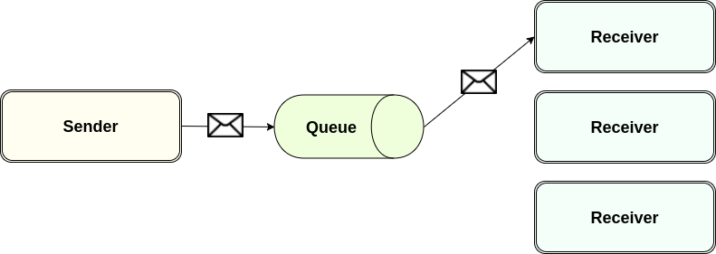
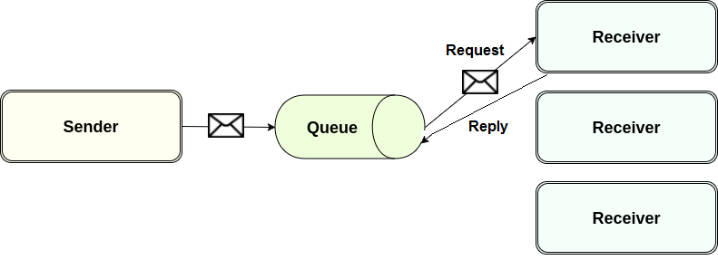
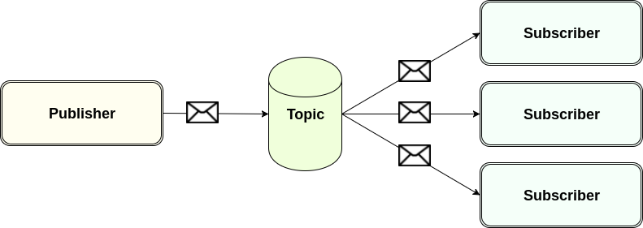

# What is messaging

## Usage Basics

* Messaging - a method of communication between software components or applications.
* A messaging client can send messages to, and receive messages from any other client.
* Each client connects to a messaging agent
* A messaging agent provides facilities for creating, sending, receiving, and reading messages.
* Messaging enables loosely coupled distributed communication.
* A component sends a message to a destination, the recipient can retrieve the message from the destination.
* The sender and the receiver do not have to be available at the same time in order to communicate

## What do sender and receiver need to know?

* The sender does not need to know anything about the receiver.
* The receiver does not need to know anything about the sender.
* The sender and the receiver need to know only which message format and which destination to use.

## What is the JMS API?

* JMS - a Java API that allows applications to create, send, receive, and read messages.
* JMS API defines a common set of interfaces that allow Java programs to communicate.
* The JMS API enables communication that is:
    * Loosely coupled
    * Asynchronous: A JMS provider can deliver messages to a client as they arrive; a client does not have to request messages in order to receive them.
    * Reliable: The JMS API can ensure that a message is delivered once and only once.
* JMS provider (broker) - a messaging system that implements the JMS interfaces and provides administrative features.
* JMS clients - Java programs or components that produce and consume messages.
* Messages - objects that communicate information between JMS clients.

## Point-to-Point messaging - fire and forget

* Point-to-Point messaging uses queues, senders and receivers.
* The message is delivered to one single receiver.
* Most providers do some round-robin algorithm to balance the receivers.

## Point-to-Point messaging - request - reply

* The sender needs to wait for the response.
* Sender cannot advance until receiving a response – blocking wait. Example: the sender places some information about a client into a queue and needs to get some confirmation that the client has been received.
* Point to point messaging supports load balancing of receivers.

## Publish - subscribe messaging

* Publish-Subscribe messaging uses topics, publishers, and subscribers.
* The message is delivered to each subscriber.
* Fire and forget broadcasting.
* Publish-Subscribe messaging supports load balancing of subscribers starting with JMS 2.0.
* Subscribers are not known by the publisher.

## Get ActiveMQ

* Download ActiveMQ http://activemq.apache.org/download.html
* Unzip the archive, you will get an ${ACTIVEMQ_HOME} folder
* Start up ActiveMQ  ${ACTIVEMQ_HOME}/bin/activemq start – default start on port 61616 (admin:admin)
* Start up producer ${ACTIVEMQ_HOME}/bin/activemq producer
* Start up consumer ${ACTIVEMQ_HOME}/bin/activemq consumer

## Usefull links

* [sfsf](https://yandex.ru)
