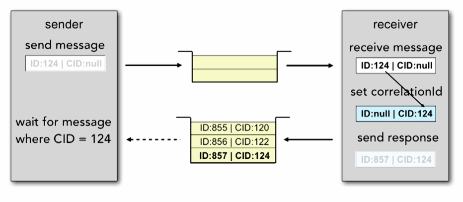
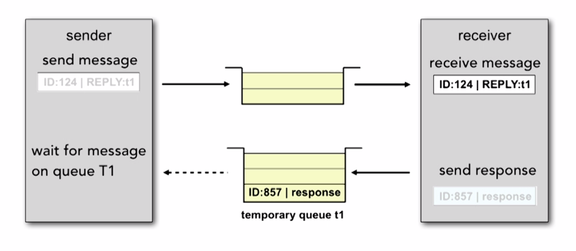

# Message Structure

## Structure of the message

A JMS message has three parts:

* The header
    * A JMS message header contains predefined fields that contain values that both clients and providers use to identify and to route messages.
    * Every message has a unique identifier, represented in the header field JMSMessageID.
    * JMSDestination represents the queue or the topic to which the message is sent.
    * Other fields include a timestamp and a priority level.
    * Each header field has associated setter and getter methods, documented in the description of the Message interface.
    * Some header fields are intended to be set by a client
    * Many header fields are set automatically by the send or the publish method, which overrides any client-set values

* The properties
* The body

Only the header is required.

## JMSMessageID

* JMSMessageID contains a value that uniquely identifies each message sent by a provider.
* Cannot be set by the developer.
* When the send or publish method returns, it contains a provider-assigned value.
* JMSMessageID is a String value - a unique key for identifying messages in a historical repository.
* All JMSMessageID values start with the prefix 'ID:'.
* Uniqueness of message ID values across different JMS vendors is not guaranteed.

## JMSDestination

* The JMSDestination header field contains the destination to which the message is being sent.
* When a message is sent, this field is ignored.
* After completion of the send or publish method, the field holds the destination specified by the method.
* When a message is received, its JMSDestination value must be equivalent to the value assigned when it was sent.

## JMSExpiration

* When a message is sent, JMSExpiration is unassigned.
* After completion of the send or publish method, it holds the expiration time of the message.
* JMSExpiration  = 0 - the message does not expire.
* When a message expiration time is reached, a provider should discard it.
* Clients should not receive messages that have expired; however, the JMS API does not guarantee this.
* The value cannot be directly set by the developer – it is overriden by the broker

```java
// ingored
message.setJMSExpiration(new Date().getTime() + 10000);

// could be used
messageProducer.setTimeToLive(10000);
```

## JMSPriority

* The JMS API defines 10 levels of priority: 0 - the lowest, 9 - the highest.
* Priorities 0-4 are normal priority, 5-9 - expedited priority.
* Default priority is 4.
* The JMS API does not require that a provider strictly implements priority ordering. It should do its best to deliver expedited messages ahead of normal messages.
* Cannot be directly set by the developer

```java
// ingored
message.setJMSPriority(9);

// could be used
messageProducer.setPriority(9);
```

## JMSDeliveryMode

* JMSDeliveryMode may be:
    * PERSISTENT
    * NON_PERSISTENT
* Default value is PERSISTENT
* The value cannot be directly set by the developer – it is overriden by the broker

```java
// ignored
message.setJMSDeliveryMode(DeliveryMode.NON_PERSISTENT);

// could be used
messageProducer.setDeliveryMode(DeliveryMode.NON_PERSISTENT);
```

## JMSTimestamp

* JMSTimestamp contains the time a message was handed to a provider to be sent.
* The actual send may occur later due to transactions or other client-side queueing of messages.
* When a message is sent, JMSTimestamp is ignored.
* When the send or publish method returns, it contains a time value between the call and the return.
* Cannot be set by the developer.

```java
// ignored
message.setJMSTimestamp(new Date().getTime() + 5000);
```

## JMSCorrelationID

### JMSCorrelationID for request - reply

* A client can use the JMSCorrelationID header field to link one message with another.
* Typical use: link a response message with its request message.
* JMSCorrelationID can hold one of the following:
* A provider-specific message ID
* An application-specific String
* A provider-native byte[] value
* JMSCorrelationIDAsBytes is used when communicating with legacy systems



### Limitations of the QueueRequestor - alternative for Correlation Id

* Cannot specify receive() timeout value.
* Cannot use transacted sessions or client acknowledgment mode.




## JMSReplyTo

* JMSReplyTo contains the destination where a reply to the current message should be sent.
* If null, no reply is expected.
* Destination may be a Queue or a Topic object.
* Messages with a null JMSReplyTo may be a notification of some event, or data the sender thinks is of interest.
* Messages with a JMSReplyTo value typically expect a response.
* Response is optional, the client will decide.

## JMSType

* JMSType may reference a message definition in the provider repository.
* The JMS API does not define a standard message definition repository, nor does it define a naming policy for the definitions it contains.
* Some messaging systems require that a message type definition for each application message be created and that each message specify its type.

## JMSRedelivered

* Gets an indication of whether this message is being redelivered.
* If a client receives a message with the JMSRedelivered field set, it is likely, but not guaranteed, that this message was delivered earlier but that its receipt was not acknowledged at that time.
* Cannot be set by the developer.

```java
// ignored
message.setJMSRedelivered(true);
```
