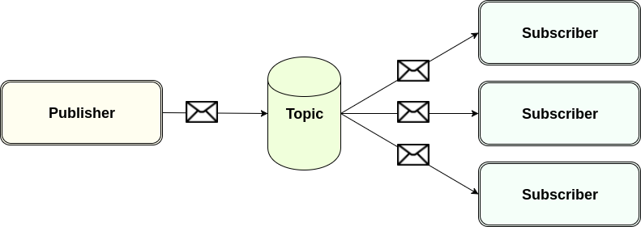

# Publish - subscribe messaging

## Basics

* Publish-Subscribe messaging uses topics, publishers, and subscribers.
* The message is delivered to each subscriber.
* Fire and forget broadcasting.
* Publish-Subscribe messaging supports load balancing of subscribers starting with JMS 2.0.
* Subscribers are not known by the publisher.

## Observer pattern

* There is a need to maintain consistency between related objects.
* Define a one-to-many dependency between objects.
* When one object changes state, all its dependents are notified and updated automatically.



## Subscriber types

* Non-durable subscriber: messages are received until the subscriber goes off-line, when the subscriber comes back online, it does not know anything about messages that have been published.
* Durable subscriber: the subscriber goes off-line, when the subscriber comes back online, it gets all messages it has missed.
* Non-durable shared subscriber: messages are received until the subscriber goes off-line, when the subscriber comes back online, it does not know anything about messages that have been published.
* Durable shared subscriber: the subscription will know all messages that have been missed while off-line, when the subscription comes back online, it gets all messages it has missed.

## Durable subscriber

* Inactive subscribers will receive stored messages when they become active again
* Uniquely identified through the topic name, client id and the subscription id

```java
// could be done like this
TopicConnection connection = new ActiveMQConnectionFactory("tcp://localhost:61616?jms.clientID=client:1").createTopicConnection();
// or like this
Topic topic = session.createTopic("ACCOUNTS.TOPIC");
connection.setClientID("client:1");
session.createDurableSubscriber(topic, "sub:1");
// durable subscriber= ACCOUNTS.TOPIC,client:1,sub:1
```

## Controlling durable subscribers

* Durable subscribers stay around until they are unsubscribed.
* If not controlled, this can create a lot of performance, thread, memory and storage issues.

ActiveMQ broker properties `conf/activemq.xml`

```xml
<broker xmlns="http://activemq.apache.org/schema/core"
 brokerName="localhost"
 offlineDurableSubscriberTimeout = "3600000“
 offlineDurableSubscriberTaskSchedule = "3600000"
 dataDirectory="${activemq.data}">
```

* `offlineDurableSubscriberTimeout`
Controls how long a durable subscriber can remain inactive before removing it

* `offlineDurableSubscriberTaskSchedule`
Controls how often to check for inactive durable subscribers

## Non-durable example:

Publisher
```java
public class JMSPublisher {

	public static void main(String[] args) {
		try {
			Logger logger = LogManager.getLogger(JMSPublisher.class);

			Connection connection = new ActiveMQConnectionFactory("tcp://localhost:61616").createConnection();
			connection.start();
			Session session = connection.createSession(false, Session.AUTO_ACKNOWLEDGE);

			Topic topic = session.createTopic("ACCOUNTS.TOPIC");
			MessageProducer publisher = session.createProducer(topic);
			for (int i = 0; i < 5; i++) {
				int amount = (int) (100 * Math.random());
				TextMessage message = session.createTextMessage("DEPOSIT " + amount + " EUR");

				publisher.send(message);
				logger.info("Message sent: {}", message.getText());
				Thread.sleep(2000);
			}
			connection.close();
		} catch (JMSException | InterruptedException e) {
			e.printStackTrace();
		}
	}
}
```

Subscriber
```java
public JMSSubscriber() {
    try {
        Logger logger = LogManager.getLogger(JMSSubscriber.class);

        TopicConnection connection = new ActiveMQConnectionFactory("tcp://localhost:61616").createTopicConnection();
        connection.start();
        TopicSession session = connection.createTopicSession(false, Session.AUTO_ACKNOWLEDGE);
        Topic topic = session.createTopic("ACCOUNTS.TOPIC");

//			TopicSubscriber subscriber = session.createSubscriber(topic);
        MessageConsumer subscriber = session.createConsumer(topic);
        subscriber.setMessageListener(new MessageListener() {
            public void onMessage(Message message) {
                try {
                    logger.info(((TextMessage) message).getText());
                } catch (JMSException e) {
                    e.printStackTrace();
                }
            }
        });
        logger.info("Waiting for messages...");
    } catch (JMSException e) {
        e.printStackTrace();
    }
}
```

Durable subscriber
```java
public JMSSubscriber() {
    try {
        Logger logger = LogManager.getLogger(JMSSubscriber.class);

        TopicConnection connection = new ActiveMQConnectionFactory("tcp://localhost:61616?jms.clientID=client:1").createTopicConnection();
        connection.start();
        TopicSession session = connection.createTopicSession(false, Session.AUTO_ACKNOWLEDGE);
        Topic topic = session.createTopic("ACCOUNTS.TOPIC");

        TopicSubscriber subscriber = session.createDurableSubscriber(topic, "sub:2");
        subscriber.setMessageListener(new MessageListener() {
            public void onMessage(Message message) {
                try {
                    logger.info(((TextMessage) message).getText());
                } catch (JMSException e) {
                    e.printStackTrace();
                }
            }
        });
        logger.info("Waiting for messages...");
    } catch (JMSException e) {
        e.printStackTrace();
    }
}
```
